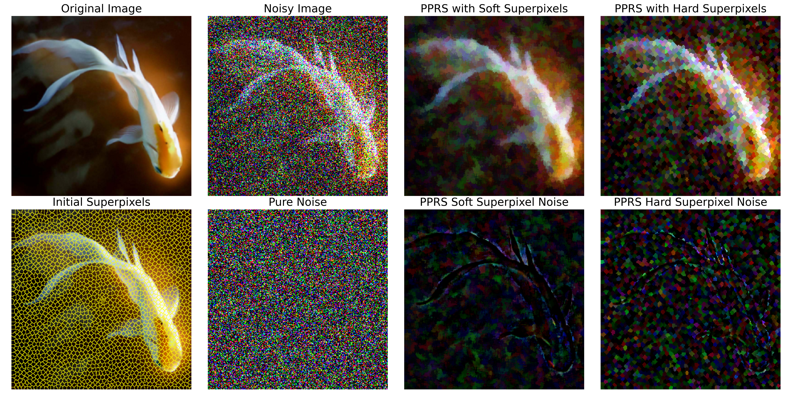
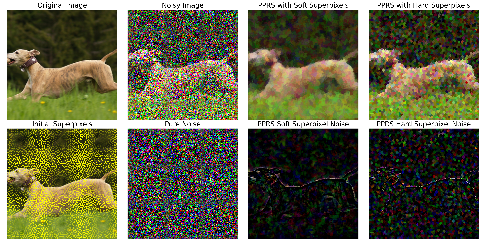
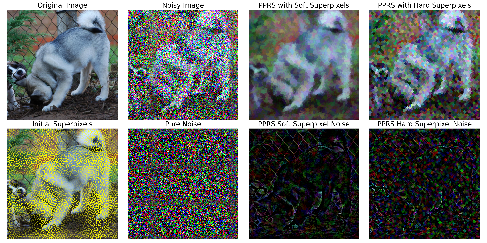
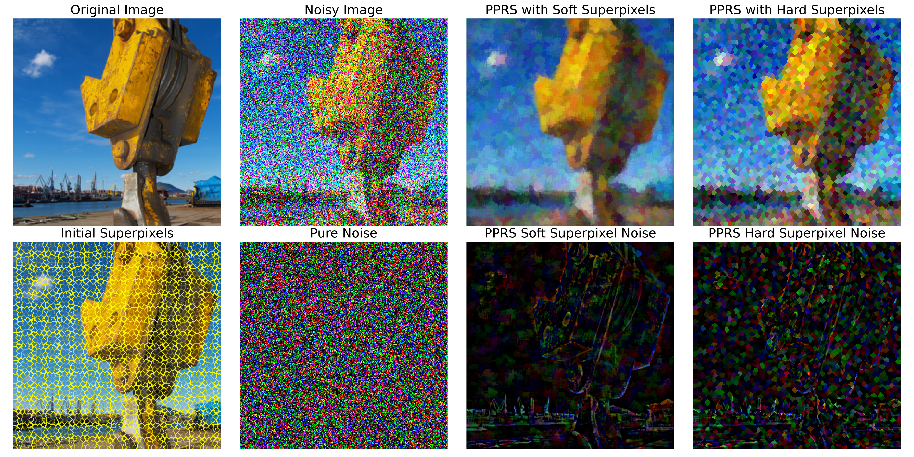
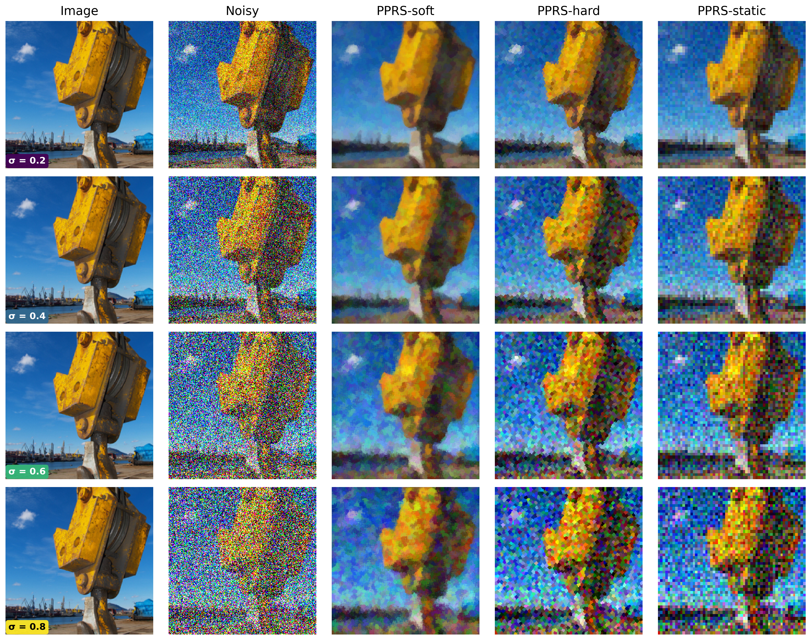
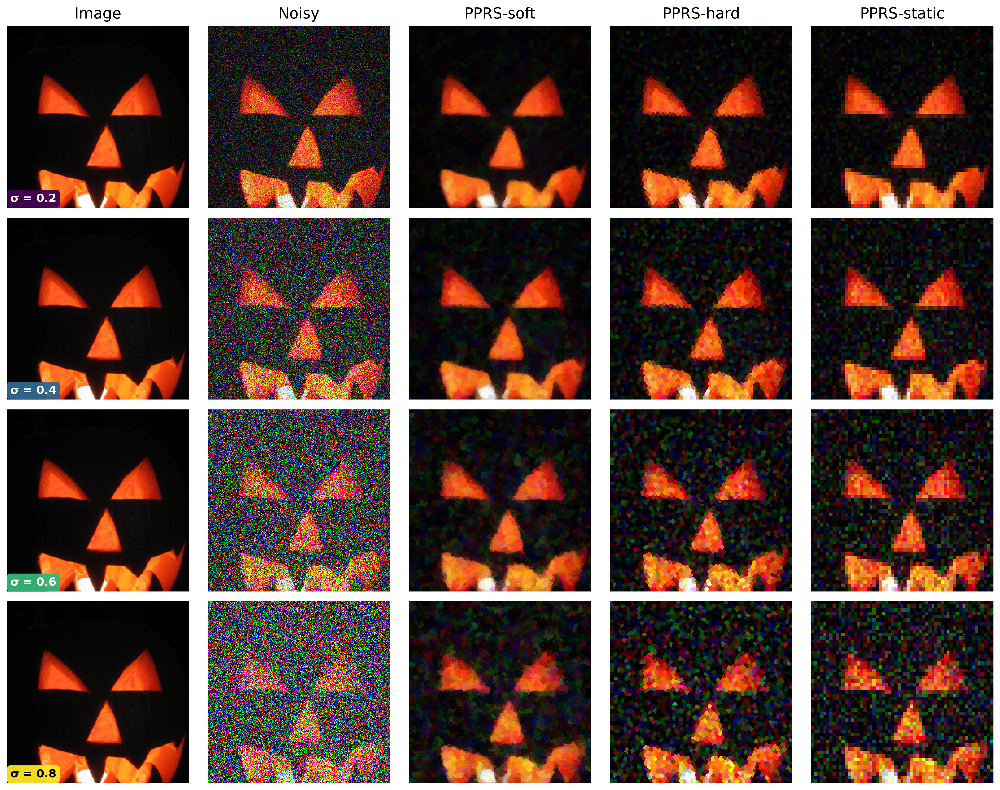
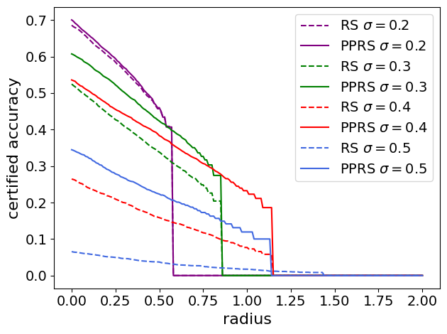
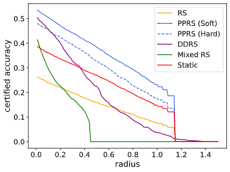
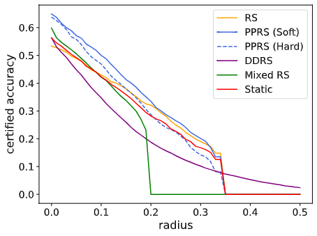

# Soft Super-Pixel Partitioning for Certified Adversarial Robustness
This repository contains the official code for the paper “Soft Super-Pixel Partitioning for Certified Adversarial Robustness.” We introduce Pixel Partitioning-based Randomized Smoothing (PPRS) and a soft superpixel variant that stabilizes boundary pixels, leading to improved certified robustness.

## Requirements and Setup

## Usage
The easiest way to play with the different super pixel algorithms and their soft counter part is the `test.ipynb` notebook where you can input any image and see how super pixels work!
For certification you can simply run certify.py, for example:


```
python certify.py --dataset cifar10 --base_classifier checkpoint.pth.tar --outfile out.csv --sigma 0.3 --seg True --alg soft --ns 200
```

## Visualization of Soft Superpixels
Here are some visualizations of soft superpixels generated by our method on different images from the ImageNet dataset. 






One intriguing question is how does soft superpixels look like on different noise levels?



Below is an ablation of PPRS on different noise levels (0.2, 0.3, 0.4, 0.5) in the ImageNet dataset. As we can see, as the noise level increases, PPRS becomes even more effective.
<p align="center">
  
</p>
PPRS outperforms other methods and is more robust.

<table>
  <tr>
    <th>ImageNet</th>
    <th>CIFAR-10</th>
  </tr>
  <tr>
    <td align="center">
      <a href="assets/imagenet.png">
        
      </a><br>
    </td>
    <td align="center">
      <a href="assets/cifar.png">
        
      </a><br>
    </td>
  </tr>
</table>
